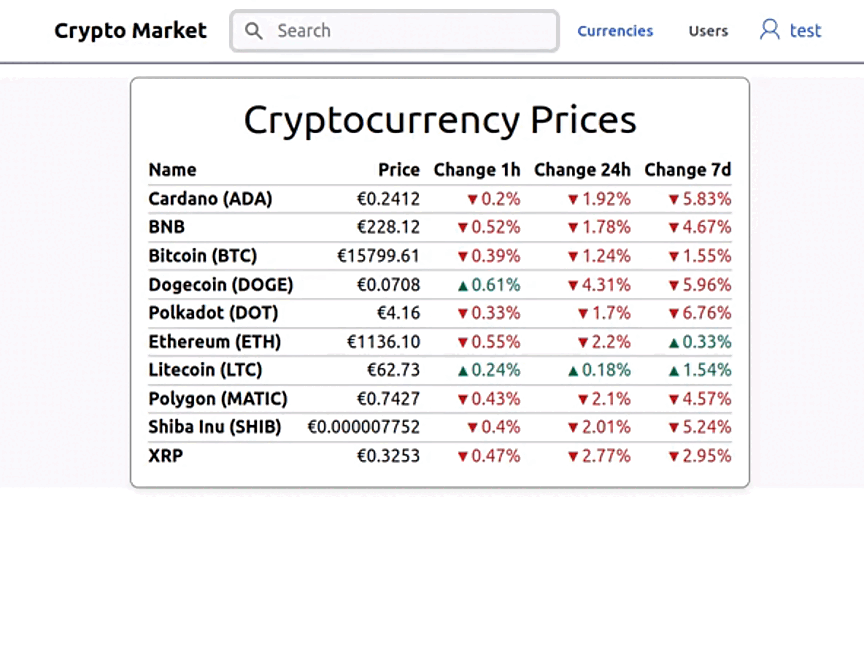
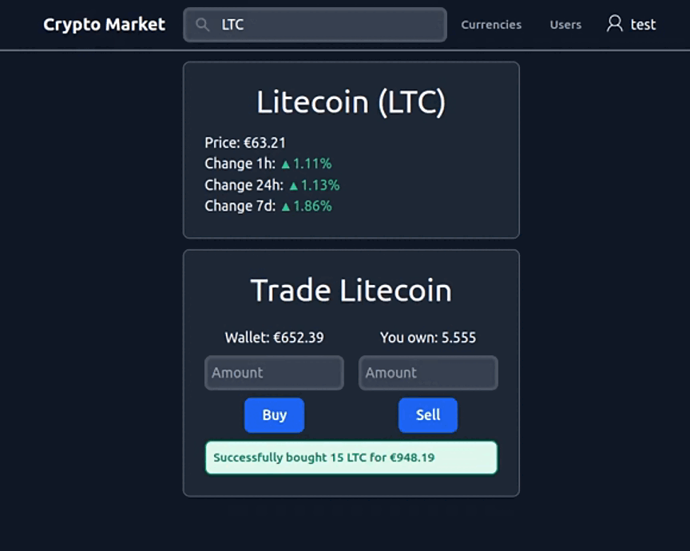

# Crypto Market website

## Features
- Change appearance between light and dark mode
- View cryptocurrency price and price changes from coinmarketcap.com API
- Register a new user, login and logout
- View wallet, edit account, delete account
- Buy, sell, and short sell cryptocurrencies 
- View user profiles and gift cryptocurrency to another user
- View transaction history and transaction statistics

## Technologies used
- PHP 7.4
- mySQL 8.0
- Composer 2.4
- Node.js npm 8.5

## Instructions to run the website
1. Clone this repository using the command:
   ```
   git clone https://github.com/tomskoralis/repository-project
   ```
2. Navigate to project directory and install the required packages using the commands:
   ```
   cd repository-project/
   composer install
   ```
3. Make a copy of the `.env.example` and rename the copy to `.env`.
4. Enter your coinmarketcap.com API key in the `.env` file.
5. Create a new mySQL database and run the `database.sql` file using the restore with 'mysql' command on the database schema.
6. Enter your database credentials in the `.env` file.
    - Fields `DATABASE_NAME`, `DATABASE_USER`, `DATABASE_PASSWORD` are required.
    - Field `DATABASE_HOST` is localhost by default and `DATABASE_DRIVER` is pdo_mysql by default.
7. Edit the `constants.php` file in the `app` directory.
8. Install Tailwind CSS and Flowbite using the commands:
   ```
   cd public/
   npm i -D tailwindcss@3.2.4
   npm i flowbite@1.5.5
   ```
9. (optional) Recompile styles
   ```
   npx tailwindcss -i styles/input.css -o styles/styles.css
   ```
10. Test the website by using the command and opening it in the browser:
   ```
   php -S localhost:8000
   ```

## Preview


### Login and edit account


### Dark mode and wallet


### Buying, selling, short selling


### Transactions, statistics, gifting
